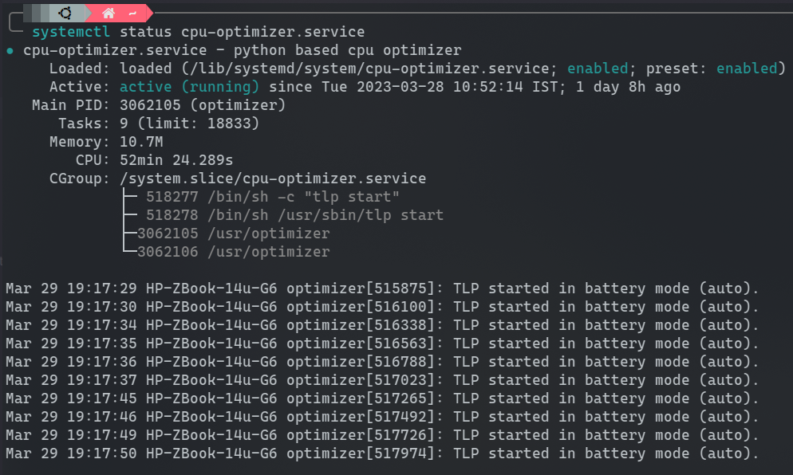

# CPU OPTIMIZER FOR LINUX
The Linux CPU Optimizer is a software application that adjusts CPU frequencies according to the CPU usage. It utilizes [TLP](https://github.com/linrunner/TLP) as its underlying framework for executing tasks. By employing this program on your desktop, you can enhance battery life. TLP is distinguished for its ability to maintain an optimal equilibrium between performance and power consumption.

Due to hardware restrictions, I won't be offering support for AMD and other processors. I am unable to purchase a different device. I would really appreciate if someone could help out.

## Installation
To test the software, adhere to these steps. Make sure TLP is set up on your computer. There is a very good chance that the maintainer of your distro has included tlp in the repository, allowing you to install it directly through your package manager. If not, you can click here to follow the TLP installation instructions - [Installation](https://linrunner.de/tlp/installation/index.html).
```
# Clone the repository
git clone https://github.com/OshankKashyap/linux-cpu-optimizer
cd linux-cpu-optimizer/

# Create a virtual environment
python3 -m venv env
source env/bin/activate

# Install Dependencies
pip3 install -r requirements.txt

# Create an Executable
pyinstaller --onefile --name optimizer main.py

# Move executable to the /usr directory
cd dist
sudo cp -r optimizer /usr
```

The following steps are to establish a system service. Please be aware that following these instructions will only result in the creation of a system service for computers running Systemd as an init service deamon.

```
cd /lib/systemd/system
sudo touch cpu-optimizer.service
```

Copy the provided configuration and paste it into the `cpu-optimizer.service` file.
```
[Unit]
Description=python based cpu optimizer

[Service]
Type=simple
ExecStart=/usr/optimizer
Restart=on-failure

[Install]
WantedBy=multi-user.target
```

Activate and start the service.
```
sudo systemctl enable cpu-optimizer.service
sudo systemctl start cpu-optimizer.service

# Activate TLP
sudo systemctl enable tlp.service
```

To find out the Cpu Optimizer's current status, use the command `sudo systemctl status cpu-optimizer.service` It should resemble to this image:
